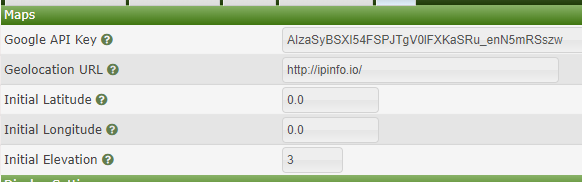
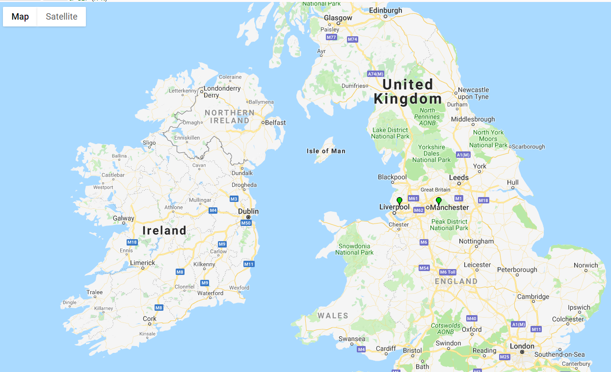

# gpsmap

Originally developed by Andy Aloia, GPSMap is a plugin that provides an
integration of Google Maps with the Cacti network graphing solution.

## Note to Users

This plugin may not be fully functional at this time.  Contribution from Cacti
users will help in stabilizing this legacy plugin in the new Cacti interface.

## Purpose

This plugin allows placing Cacti devices on a physical map.  Such mapping is
important for wireless providers or people who have devices in multiple
facilities geographically dispersed.

## Features

GPSMaps is a simple plugin designed to show you where your devices are located
via Google Maps and has the following features:

* Device Templates define which devices can be added to a map

* Devices matching a defined template are automatically added during each poller
  run

* Device status is show as Up, Recovering or Down using images

* Extra information can be found by hovering over a device on the map

## Installation

To install, create a folder called `gpsmaps` under the `<cacti>\plugins` folder
and copy all files to there.  Make sure that the directory permissions allow the
website to write to the `<cacti>\plugins\gpsmaps\XML` folder (note that is
uppercase for case sensitive file systems such as Linux).

Once all files have been copied, visit the Plugins management page in the Cacti
Console (Console -> Settings -> Plugins) and Install, then Enable the plugin.
At this point, a new Settings tab will have been added for GPSMaps and the
following is a minimum you should fill in:

* **Settings Screenshot**

  

* **Google API Key**

  You can obtain a Google Maps API key from the [Google
Developers](https://developers.google.com/maps/documentation/javascript/get-api-key)
site.  When GPSMaps was started, this was completely free.  Currently, you can
sign up for Google Maps API though it will likely ask you to setup a billing
account.  It will then proceed to give you $300 of credit and notify you that no
charges will be made unless you upgrade from the free account.

  ***Note:** Without this, no Map API will work*

* **Initial Latitude, Longitude, Elevation**

  You should set the Latitude/Longitude so that the initial map centers on the
  center of your distributed devices.  You can zoom in by entering a higher
  elevation factor (note these can only be whole numbers at this time).  The
  following is an example of how to default to showing the whole world:

  Setting | Value
  --- | ---:
  Latitude | 0.0
  Longitude | 0.0
  Elevation | 2

The next step is to add all the device templates that should be mapped using the
following steps:

1. Click on Console -> Templates -> Map

2. Click the + on the right of the `Map Templates` title

3. Enter the appropriate details:

   Type | Meaning
   --- | ---
   Device Template | Select the Device Template that matching devices must have
   Images | The image to be displayed as a marker for any device that is in the Up, Recovering and Down states
   Access Point | Whether the template represents an access point

4. Click Save

With the device templates associated to GPS Maps, the next step is to add
GeoLocation information to each device.  For any device with an external IP
address, this will be resolved to an approximate location based on the
GeoLocation service set within the Maps settings tab.

1. Edit a device
2. Enter the Lat/Long details
3. Save the device.

At this point, you need to wait for your polling cycle to have completed and
then you should be able to see your devices being mapped when you click on the
Top Header's Map tab.

## Possible Bugs

If you figure out this problem, see the Cacti forums!

## Future Changes

Got any ideas or complaints, please create an issue in GitHub. Examples include:

* Other Map providers, such as OpenStreets should be configurable

* Allow better filtering by

  * Allowing Device Templates to be temporarily disabled

  * Allowing Sites to help filter what devices are shown

  * Creating Regex-based rules to filter out individually unwanted devices

## Changelog

--- 2.1 ---

* issue: Add gpsmap_templates table index to be unique by device template

* issue: Remove some Google Maps API deprecation warnings

* feature: Remove some legacy imagery in the map view for 'print' and 'start
  over'

* feature: Allow Icons in Map Templates to be shown as Icons when editing

* feature: Make the Map Templates interface follow Cacti UI standards

--- 2.0 ---

* First attempt at Cacti 1.x framework

--- 1.8 ---

* All Google Maps API

* 2 components are replaced with the ones from version 3

* GDownloadUrl is replaced with a custom function

* GXml.parse is replaced with a custom function

* Replacement of GMarker.openInfoWindowTabsHtml with the InfoBubble library made
  by Luke Mahe :

  [infobubble](http://google-maps-utility-library-v3.googlecode.com/svn/trunk/infobubble/)

* Google Maps API key is no longer required, GPSMap setting panel has been
  updated in consequence

* Almost all of the JavaScript code is moved in the /js/GPSMaps.js file

* A JavaScript namespace "gpsmap" is created in order to avoid global variables
  and conflict with others libraries

* GPL license version 2 is added to the files structure

* A GPL license summary is added in each source code file

--- 1.7 ---

* Redesigned how XML and KML files are created.

* Files are created on poller hit

* Created both KML and XML files for each level.

* Monitor certain levels of subnets by picking appropriate file. Useful for NOC
  who only needs supervision of certain subnet

* Overlay is computed each cycle, toggle is in the settings

* Error checking for correct GPS coordinates entry, coordinate will default to
  0.0000 if error is found SQL does some checking, ran against regex to be sure

* Lots of redundant code from 1.63 has been removed.

* Direct links to XML and KML have been added next to the subnet

--- 1.63 ---

* Emergency update.

* Fixed relying on Google for icon files.

* All icons are contained within the images\icons folder

* Made coverage overlays the last part to be rendered.

* Fixed bug where coverage overlays would eat up RAM by causing a invalid for
  loop.

--- 1.62 ---

* Changed the processing of points.

* Reduced some DB queries by half.

* Thanks to Nate for the tabs:
  [Google Maps API Forum Link](http://groups.google.com/group/Google-Maps-API/browse_thread/thread/b023708935be9392/ae9ca67ef4e8b136%3Fshow_docid=ae9ca67ef4e8b136)

* Nodes close to each other are grouped into tabs. There is a threshold setting
  for this.

* One bud is that the nodes put into the tabs are not removed form the map.

* In Map template creator. You can now edit the templates.

* Allowed for Multiple host types to be designated as APs

* Hides AP options when not applicable to the device.

* Customizable refresh interval

* Can define a group for each device. All devices by default are in group 0.

* Can set the angle of the overlay to have a directed overlay map

* Automatic Overlays will only use the devices in their group to determine
  distance.

* If you don't want automatic radius distance, you can directly control the
  radius of the overlay around a single AP

* Changed several DB Columns to Decimal instead of Float for greater precision

* Thanks to Niobe, the annoying bug that dealt with the GPSMaps tab not turning
  read has been fixed.

* Map is now almost full screen due to fix.

* The 1.6 code base in general has been rewritten and sorted out to provide
  easier following of execution path.

* Version 1.62 is more PIA standards compliant! This means if you uninstall the
  plugin IT WILL REMOVE YOUR GPS DATA.

* Always backup your database before installing or removing this plugin!

* Sorry for the long wait!

--- 1.51 ---

* Minor bug fixes, there was one leftover <php= VAR ?> left around

* some small tweaks to the KMLcreation file to prevent errors on 0 indexes.

* small fix to remove some pulled settings.

--- 1.5 ---

* Yeah... forgot to update the ChangeLog for all of the changes. So v1.5 because
  it is a major update

* Weather has been disabled. Some code is still left in there for the prying
  people

* KML exporting is fully supported

* Templates for up/down/recover have been set

* GPS maps outputs the templates and set colors and images accordingly.

* I haven't fully fixed the setup database script yet, so...there will need some
  work

* Added a few parameters to the host class to accommodate the changes

* So long as original server accepts connections Google earth should get custom
  images.

* Still small bug with the console always being red

* Removed the custom hosts file, it is no longer needed.

* Several new files, to accommodate GUI updates

* A big thanks to the thold plugin for helping me out.

--- 1.41 ---

* Added the UP/Down/Recovery viewing. Hosts change color based on status. Colors
  correspond to cacti designated colors.

* Added the ability to display disabled hosts. These will show up as BLACK
  markers to ensure that a difference can be seen.

* Added a preliminary test for overlaying current radar information. Take a look
  at the Weather.php file for more info.

* Modified the navigation to allow for mouse wheel usage.

--- 1.4 ---

* Complete overhaul of the Host/Tower management. Moved over to an object
  oriented design that effectively reduced the amount of database calls at
  minimum of half. This should speed up the displaying of the map. * The top
  grey bar now dynamically sizes to the height of the text.

* The final IP analysis area displays all IP address for that range, this links
  to that hosts graphs. This can make a problem of having multiple rows of grey
  bars with IP addresses. Looking for solutions.

* A maximum of 6 IP address will be stacked before moving onto the next column.

* In the GPSMap settings, I have made simpler the setup of the tower Host ID.
  Just select the template that is being used by your towers/APs.

* New Towers Only mode selectable in the settings, guess what it does? Thats
  right, displays on the towers. It can also display coverage maps

* Added a print button. DOES NOT PRINT OVERLAY. Takes a little bit of guess work
  to get a pic of what you want, but at least it works.

* Made map navigation to a full nav bar. It got annoying just using the (+) and
  (-) buttons.

--- 1.37 ---

* Fixed bug that would have multiple overlays for one tower, each overlay being
  a different size.

* Fixed bug that would keep towers from overlaying proper distance.

* Fixed When multiple points were on the same IP range they could potentially
  have a circle drawn about them, if conditions were right.

* Added multiple AP Overlay mode. This is to allow multiple overlays per IP
  range. By default it only allows one overlay per IP range. (IP range is
  defined as the 192.168.XXX.YYY Where XXX differs between ranges)

* Added link to the host graphs from the icon pop-up.

* Will only display ENABLED hosts. Will add the option later to display all
  hosts.

--- 1.36 ---

* Fixed bug that mistakenly displayed incorrect towers and nodes when in regular
  mode.

* Fixed bug that displayed all towers no matter what IP range settings when in
  coverage mode.

* Changed the way the IP Region adds to an array. This is to make it a dynamic
  array and decrease wasted space.

--- 1.35 ---

* Increased float range in database for increased accuracy. Up to 13 characters
  for Lat/Long now

* removed the integer conversions in code to increase accuracy

* Added customizable options in the settings.

--- 1.34 ---

* Allowed for towers in the same IP range to graph a circle. This might not be
  the best way to approach this issue. But seeing that there is no way to get
  actual connected subscribers, IP range is the only way to do this.

--- 1.33 ---

* Found some math errors and corrected

* First dynamic plotting of overlay done.

* Modified the coverage XML to make each tower an object and treat them as such.

* (speculation on the use of objects for the IP analysis)

--- 1.32 ---

* Made for the addition of static circles on simple points based on lat/long

* Started work on how to get distance from tower bases.

* most of the PHP for the coverage XML has been written

--- 1.31 ---

* A lot of changes in preparation for the addition of circle overlays for
  coverage.

* Created a base to work from

--- 1.3 ----

* Implemented PIA 2.x standards

* Fixed partially, Bug when performing an IP analysis and no IP address is
  specified in hostname area. Currently it will not display those devices.

* Fixed some minor inconsistencies involving the XML output to Google maps.

* Ensured that install/uninstall works and removed database columns

--- 1.2 ---

* Allowed ways for users to add custom GPS types (non-GUI)

* set width to be a permanent 100% (still have not fixed height)

* In settings changed tab name to GPS Map

* Added a lot of in-code commenting.

--- 1.11 ---

* Cleaned up code for the IP tracking

* Added multiple colors for points based on type of device(currently only hard
  coded)

* Added information when point is clicked

--- 1.1 ---

* added preliminary IP range tracking

* cleaned up some of the code for settings and such

--- 1.02 ---

* few optimization's and less DB calls

--- 1.01 ---

* Ability to set parameters for map

--- 1.0 ---

* Initial Release

* Display map with hard coded static parameters.

* Enter Hosts Lat & Long in host settings
