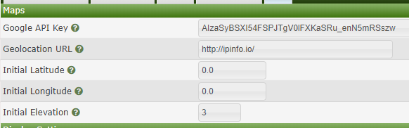
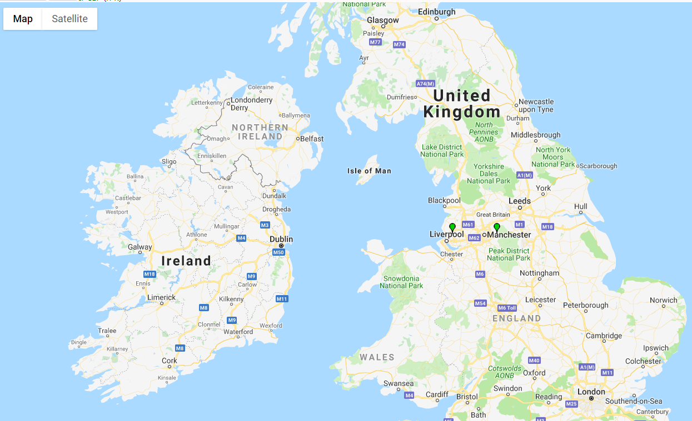

# gpsmap

Originally developed by Andy Aloia, GPSMap is a plugin that provides an
integration of Google Maps with the Cacti network graphing solution.

## Note to Users

This plugin may not be fully functional at this time.  Contribution from Cacti
users will help in stabilizing this legacy plugin in the new Cacti interface.

## Purpose

This plugin allows placing Cacti devices on a physical map.  Such mapping is
important for wireless providers or people who have devices in multiple
facilities geographically dispersed.

## Features

GPSMaps is a simple plugin designed to show you where your devices are located
via Google Maps and has the following features:

* Device Templates define which devices can be added to a map

* Devices matching a defined template are automatically added during each poller
  run

* Device status is show as Up, Recovering or Down using images

* Extra information can be found by hovering over a device on the map

## Installation

To install, create a folder called `gpsmaps` under the `<cacti>\plugins` folder
and copy all files to there.  Make sure that the directory permissions allow the
website to write to the `<cacti>\plugins\gpsmaps\XML` folder (note that is
uppercase for case sensitive file systems such as Linux).

Once all files have been copied, visit the Plugins management page in the Cacti
Console (Console -> Settings -> Plugins) and Install, then Enable the plugin.
At this point, a new Settings tab will have been added for GPSMaps and the
following is a minimum you should fill in:

* **Settings Screenshot**

  

* **Google API Key**

  You can obtain a Google Maps API key from the [Google
Developers](https://developers.google.com/maps/documentation/javascript/get-api-key)
site.  When GPSMaps was started, this was completely free.  Currently, you can
sign up for Google Maps API though it will likely ask you to setup a billing
account.  It will then proceed to give you $300 of credit and notify you that no
charges will be made unless you upgrade from the free account.

  ***Note:** Without this, no Map API will work*

* **Content Security Policy**

  The map is drawn by JavaScript that Cacti loads from Google, and Cacti's
  default Content Security Policy only permits scripts served by the Cacti web
  server itself.  Until the policy is widened, the Maps tab renders as a blank
  page and the browser console reports a `Refused to load the script` error
  naming `maps.googleapis.com`.

  Both settings below were added in Cacti 1.2.15.  On an older core they do
  not exist, and the map cannot be made to work without widening the policy
  at the web server instead.

  Under Console -> Configuration -> Settings -> General, set:

  Setting | Value
  --- | ---
  Content-Security Alternate Sources | `https://maps.googleapis.com https://maps.gstatic.com`
  Content-Security Script Policy | Allow both unsafe-eval and Non-Nonced Inline JavaScript

  The Google Maps loader calls `eval()`, so the plain *Allow Non-Nonced Inline
  JavaScript* mode is not sufficient.  Both settings are required.

  If your Cacti is fronted by a reverse proxy that sets its own
  `Content-Security-Policy` header, that header replaces Cacti's entirely.
  Reproduce the whole policy there, not just the two hosts: the `script-src`
  directive still needs `unsafe-eval` and inline script permitted, or the map
  stays blank with Cacti's own settings correct.

* **Initial Latitude, Longitude, Elevation**

  You should set the Latitude/Longitude so that the initial map centers on the
  center of your distributed devices.  You can zoom in by entering a higher
  elevation factor (note these can only be whole numbers at this time).  The
  following is an example of how to default to showing the whole world:

  Setting | Value
  --- | ---:
  Latitude | 0.0
  Longitude | 0.0
  Elevation | 2

The next step is to add all the device templates that should be mapped using the
following steps:

1. Click on Console -> Templates -> Map

2. Click the + on the right of the `Map Templates` title

3. Enter the appropriate details:

   Type | Meaning
   --- | ---
   Device Template | Select the Device Template that matching devices must have
   Images | The image to be displayed as a marker for any device that is in the Up, Recovering and Down states
   Access Point | Whether the template represents an access point

4. Click Save

With the device templates associated to GPS Maps, the next step is to add
GeoLocation information to each device.  For any device with an external IP
address, this will be resolved to an approximate location based on the
GeoLocation service set within the Maps settings tab.

1. Edit a device
2. Enter the Lat/Long details
3. Save the device.

At this point, you need to wait for your polling cycle to have completed and
then you should be able to see your devices being mapped when you click on the
Top Header's Map tab.

## Possible Bugs

A blank Maps tab is almost always the Content Security Policy rather than a
fault in the plugin.  Open the browser console first: a `Refused to load the
script` entry naming `maps.googleapis.com` means the two settings described
under Installation have not been applied.

If you figure out this problem, see the Cacti forums!

## Future Changes

Got any ideas or complaints, please create an issue in GitHub. Examples include:

* Other Map providers, such as OpenStreets should be configurable

* Allow better filtering by

* Allowing Device Templates to be temporarily disabled

* Allowing Sites to help filter what devices are shown

* Creating Regex-based rules to filter out individually unwanted devices

-----------------------------------------------
Copyright (c) 2004-2026 - The Cacti Group, Inc.
